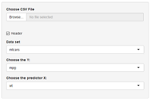
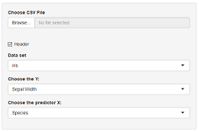

```{r setup, include=FALSE}
knitr::opts_chunk$set(echo = TRUE)
library(ggplot2)
```


## Overview {.smaller}


- This was built for the course Developing Data Products as part of the Coursera Data Science Specialization.


- The shiny app developed for this assignment is avalilable at: https://thierryfauret.shinyapps.io/univariate_analysis/


- The source codes of ui.R and server.R are available on the GitHub repo: https://github.com/FAURET/My_first_shiny_application


## Application presentation {.smaller}


The objective of the application is to perform <span style="color:blue">**univariate analysis**</span> from a data frame.


<span style="color:blue">**The input data are :**</span>

- a **data set** :  either a data frame availabe in the standard R package **"datasets"** or an imported CSV file.

- choice of a parameter **Y** present in the data frame.

- choice of the parameter **X** present in the data frame.


<span style="color:blue">**The output data are :**</span>

- a graphic representation of Y versus X (**scatter plot** if X is numeric and **box plot** otherwise)

- summary of the linear regression


## Output when X is numeric {.smaller}
<span style="color:blue">**Input data :**</span>




<span style="color:blue">**Output data :**</span>


````{r echo=FALSE,fig.width = 4, fig.height = 2}
library(ggplot2)
library(datasets)
g<-ggplot(data=mtcars,aes(wt,mpg))
g<-g+geom_point(size=2,alpha=0.2)+geom_smooth(method="lm")
g<-g+theme(axis.title.x=element_text(size=14),axis.title.y=element_text(size=14),axis.text=element_text(size=12))
g

````

And the application displays the summary of the linear regression (lm(mpg ~wt) in this case).
                     
## Output when X is not numeric {.smaller}

<span style="color:blue">**Input data :**</span>




<span style="color:blue">**Output data :**</span>


````{r echo=FALSE,fig.width = 4, fig.height = 2}
library(ggplot2)
library(datasets)
g<-ggplot(data=iris,aes(Species,Sepal.Width))
g<-g+geom_boxplot()
g

````

And the application displays the summary of the linear regression (lm(Sepal.width~Species) in this case).
