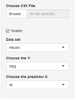
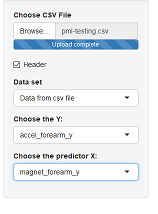
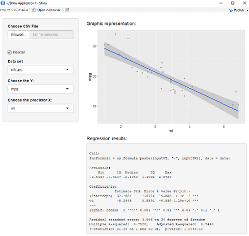
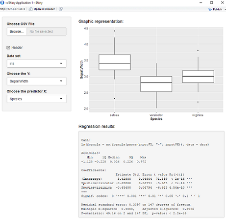

```{r setup, include=FALSE}
knitr::opts_chunk$set(echo = FALSE)

```


## Application presentation {.smaller}

The objective of this application is to perform univariate analysis from a data frame.


The input data are :

- a **data set** : either a **data frame** availabe in the standard R package or a data frame imported from a **CSV file**.

- choice of a parameter **Y** present in the data frame.

- choice of the parameter **X** present in the data frame.


The output data are :

- a graphic representation of Y versus X (**scatter plot** if X is numeric and **box plot** otherwise)

- summary of the linear regression


## Input data {.smaller}

In the application, the following data frame are proposed: mtcars, morley, rock, iris.
Remark : it is very easy to initiate a longer list.


After having choosen the data frame, select the Y name and the X name, you want to analyze.



In this example : mtcars data set is selected. Y is  mpg (consumption) and X is wt (weigth).

## Import CSV file {.smaller}

If you want to analyze your own data base available in a CSV file, 

1. you must firstly import the file.

        - you must specify if the parameters names are in the first row by using the header box.
        
        - you select the CSV file.


2. you select the data set **" Data frame from CSV file"**.


3. you select **Y name** and **X name** as you do for data frames proposed in the list. 



In this example : header is selected, the csv file is plm-testing.csv and the parameters analyzed are : accel_forearm_y and magnet_forearm_y.


## Output : if X is numeric {.smaller}


In this example : mtcars data set is used. The correlation between mpg (consumption) and wt (weigth) is analyzed. A regression line is plotted as X and Y are continuous.


## Output : if X is not numeric {.smaller}




In this example : iris data set is used. The influence of the sepcies on Sepal.width is analyzed. As species is a discrete parameter, a box plot is displayed.